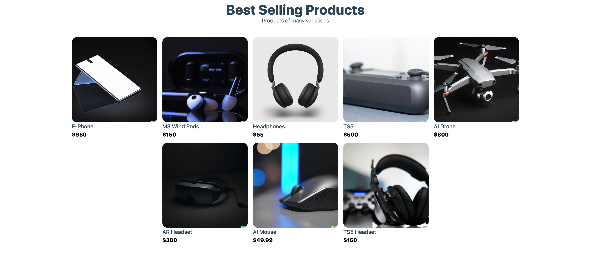

# AI Ecommerce

## ECommerce Application with Sanity headless CMS and Stripe payment processing

AI E-commerce is a technology store front featuring products generated by DALL·E 2 AI. The store makes use of NEXT.js server-side rendering for fast load times and a headless CMS for making fast updates to products and page components. The shopping cart component utilizes  HTML 5 local storage for data persistence and keeps track of state using react hooks. Stripe integration provides a simple and fast checkout process for customers as well!

### Technologies used

- React
- Next.js
- Sanity
- Stripe
- Vercel